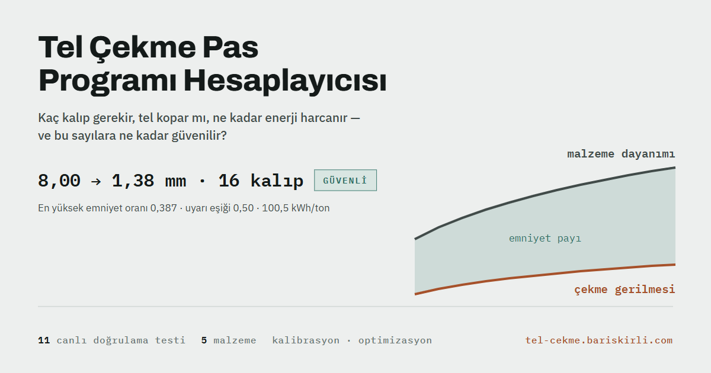

# Tel Çekme Pas Programı Hesaplayıcısı

Bakır tel çekme pas programını, çekme gerilmesini, mekanik gücü ve parametre
belirsizliğini hesaplayan bir **ön tasarım aracı**. Deneysel olarak kalibre edilmiş
bir kırılma veya üretim onay sistemi değildir.

Bulgu şu: emniyet oranı `σ_d / σ_f` ifadesinde pekleşme katsayısı `K` sadeleşir
(iki terim de `K` ile doğrusaldır). Literatürdeki en geniş belirsizlik ETP bakırın
`K` değerindedir — 315–530 MPa, yani ±%26 — ama bu belirsizlik kopma riskini
bu modelde, **70 MPa akma tabanı devre dışıyken**, gerilme/akma oranını etkilemez;
kuvveti, gücü ve sıcaklık artışını oranlı biçimde ölçekler. Sürtünme de bu oranı etkiler.
Araç bunu köşe taraması tablosunda doğrudan gösterir: `μ` 0,03'ten 0,08'e çıkınca
aynı program 0,451'den 0,571'e, yani güvenli bölgeden sınırın üstüne geçer.

**[Aracı aç →](https://tel-cekme.vercel.app/)** · tek HTML
dosyası, sıfır bağımlılık, çevrimdışı çalışır.



## Ne hesaplar

8 mm filmaşinden hedef çapa inen bir çekme hattı için pas programı kurar ve her
pasta şunları verir: kesit azalma, birikmiş gerinim, ortalama akma gerilmesi,
çıkış dayanımı, çekme gerilmesi, **emniyet oranı**, delta faktörü, adyabatik
sıcaklık artışı, çıkış hızı ve mekanik güç.

Pas dağıtım yöntemleri:

| Yöntem | Ne yapar |
|---|---|
| Eşit gerinim | Her pasta aynı oransal kesit azalması — kitap standardı, karşılaştırma tabanı |
| Kademeli azalan | Başta ağır, sonda hafif — fabrikaların gerçekte yaptığı |
| Eşit emniyet | Her pasın emniyet oranını hedefe (0,50) eşitler; otomatik modda **hedefi tutan en küçük pas sayısını** bulur |
| Manuel | Kendi çap dizinizi yapıştırın |

Otomotiv ince senaryosunda (8,00 → 1,38 mm) eşit gerinim 16 pas ister; eşit emniyet
aynı güvenlik seviyesini **11 pasla** tutturur — 5 kalıp az, %7 daha az enerji.
Bedeli de görünür: 11 pasta delta 1,32'ye (aşırı sürtünme sınırı) ve adyabatik ΔT
100,3 °C'ye çıkar, araç ikisini de uyarı olarak gösterir ve gereken kalıp açısını
(9,1°) söyler.

## Kalıp çapına yuvarlama

Hesap `7,197 mm` der; kalıp deposunda öyle bir kalıp yoktur. Araç çap dizisini
gerçek kalıp adımına (0,01 – 0,25 mm) oturtur. **Uç çaplara dokunulmaz:** giriş
filmaşini hattın beslemesi, son çap ürünün kendisidir; ikisini yuvarlamak soruyu
değiştirmek olurdu.

Adım kaba olduğunda iki komşu çap aynı değere düşebilir. O durumda dizi düzeltilmez,
**reddedilir** ve hangi çiftin çakıştığı söylenir — sessizce "yakına benzer bir şey"
üretmek aracın bütün mantığına aykırı olurdu.

Yuvarlamanın bedeli görünür: genel amaçlı senaryoda 0,05 mm adımı on çapı kaydırıyor
(en büyük sapma 0,025 mm) ve en yüksek emniyet oranı **0,389'dan 0,410'a** çıkıyor.
İdeal program ile depodan çıkan program arasındaki fark tam olarak budur.

## Sürtünme kalibrasyonu

Bir pasta **ölçülen çekme kuvvetini** girin; araç Siebel bağıntısını ters çevirip
o hattın sürtünme katsayısını çözer. Aracın kendi duyarlılık analizi en kritik
parametrenin `μ` olduğunu söylüyor — `K` emniyet oranında sadeleşir, `μ` sadeleşmez —
ve `μ` literatürden bilinemez: yağa, kalıp yüzeyine ve hıza bağlı olarak hatta özgüdür.
Tek bir ölçüm modeli o hatta bağlar.

Çekme gerilmesi `μ`'de monoton artandır, dolayısıyla ters çözümün kökü tektir;
ikili arama kullanılır. Ölçüm modelin kapsadığı aralığın dışındaysa sayı
uydurulmaz, hangi sınırın aşıldığı söylenir: sürtünmesiz alt sınır (`μ = 0`)
ya da `μ = 0,30` üst sınırı, ikisi de kuvvet cinsinden yazılır.

Genel amaçlı senaryoda 3. pasın model kuvveti 4025 N. Sahada 4508 N ölçülmüşse
(%12 fazla) çözülen değer `μ = 0,0895` olur ve araç şunu söyler: o pasın emniyet
oranı 0,470 değil **0,527**, yani uyarı eşiğinin üstünde. Kalibrasyonun bütün
anlamı bu cümlededir.

Çözülen `μ` ekrandaki sayıları değiştirmez; girdilere alınır ve sonucu HESAPLA
getirir (K-16).

**Sınır:** Kasnak momentinden hesaplanan kuvvet aktarma ve yatak kayıplarını da
içerir, bu yolla çözülen `μ` sistematik olarak yüksek çıkar. Güvenilir sonuç kalıp
önü/arkası gerilme ölçümü ister. Çözülen sayı, modelin bütün kabullerini (sabit `μ`,
izotermal akma, girilen geri gerilim) üstlenen tek bir değerdir.

## Geri gerilim

Çok kasnaklı hatlarda tel kalıba gerili girer. Geri gerilim `σ_b` artık girdidir
(varsayılan 0). Çekme gerilmesine eklenen pay `σ_b · e^(−μ·cotα·ε)`: geri gerilimin
tamamı kalıbın öbür tarafına geçmez, sürtünme bir kısmını yutar. Bu, Sachs
çözümünün `(A₁/A₀)^B` aktarım çarpanıdır — `A₁/A₀ = e^(−ε)` olduğu için üstel biçime
iner. **Melezdir:** taban Siebel, terim Sachs; ikisi aynı türetmeden gelmez ve
[`docs/kaynaklar.md`](docs/kaynaklar.md) bunu böyle yazar.

Referans pasta 40 MPa geri gerilimin 36,6 MPa'ı çıkışa geçiyor (aktarım 0,914) ve
en yüksek emniyet oranı 0,389'dan 0,466'ya çıkıyor.

**Asimetri bilinçli:** model geri gerilimin **bedelini** gösterir (çekme gerilmesi
artar), **faydasını** gösteremez (kalıp basıncı ve aşınma azalır), çünkü kalıp
aşınması hiç modellenmiyor. Yani araç geri gerilimi her zaman olumsuz gösterir;
gerçek hatta geri gerilim bir kalıp ömrü tercihidir.

`σ_b = 0` girildiğinde bütün eski sayılar birebir korunur — bir test bunu sınar.

## Makine kısıtları

Modelin sınırları fizikten gelir; bunlar fabrikadan. Üçü de isteğe bağlıdır ve boş
bırakılan kısıt uygulanmaz:

| Kısıt | Ne yapar |
|---|---|
| Pas başına güç sınırı (kW) | Bir kasnağın motor gücü. Tablodaki mekanik güç bununla karşılaştırılır |
| Hat hızı sınırı (m/s) | Hattın güvenle çalıştığı en yüksek çıkış hızı |
| Mevcut kalıp sayısı | Optimizasyon bundan fazla pas öneremez |

Kısıtlar hesabı **değiştirmez, değerlendirir**: aynı program aynı sayıları verir.
İki yerde çalışırlar — ekrandaki program bir sınırı aşarsa yorum kutusu hangi pasta
ne kadar aşıldığını söyler (*"Pas 11 35,5 kW çekiyor; makine sınırı 28,0 kW"*), ve
optimizasyon taraması kısıtı aşan adayı eler.

Kısıtlar sağlanamıyorsa sayı uydurulmaz: tarama "bütün kısıtları sağlayan program
bulunamadı" der ve uygulanan makine sınırlarını listeler — çünkü çoğu zaman sebep
fizik değil, girilen sınırdır.

## Optimizasyon

Çapları ve malzemeyi sabit tutup **kalıp yarı açısını, dağıtım yöntemini ve pas
sayısını** tarar; bütün kısıtları sağlayan en iyi programı bulur. Amaç seçilir:
en az enerji ya da en az kalıp. Kısıtlar aracın kendi eşikleridir — emniyet ≤ 0,50,
delta 1,5–3,0, ΔT ≤ 100 °C, kesit azalma ≤ %63,2.

Tarama deterministiktir: kalıp açısı 4–12° arasında 0,1° adımla, pas sayısı 1–60
arasında denenir. Eşit gerinim ve kademeli azalan tam ızgarada; eşit emniyet
çağrı başına ~70 ms sürdüğü için kaba (1°) sonra ince (0,1°) aramayla ve kendi
otomatik pas sayısıyla taranır. Genel amaçlı senaryoda ~9700 aday, tarayıcıda
yarım saniye.

Otomotiv senaryosu farkı iyi gösteriyor: eşit emniyet 11 pas bulur, **optimizasyon
12 der** — çünkü 11 pasta delta alt sınırın ve ΔT üst sınırın dışına çıkıyor.
Kısıtlara uyan en iyi program, kısıtsız en küçük program değildir.

Bulunan program ekrana yazılmaz, **girdilere alınır**; bekleyen değişiklik şeridi
ne değiştiğini söyler ve sonucu HESAPLA getirir (K-16).

Sonuç bir **model optimumudur**. Model sürtünmeyi kalıp açısından bağımsız sabit
alır; kalıp aşınmasını ve yağ filmi rejimini görmez. Arayüz bu
cümleyi sonucun altında taşır.

## Hesap ne zaman çalışır

Ekrandaki sayıları değiştiren tek şey **HESAPLA** düğmesidir. Girdi yazmak,
hazır senaryo seçmek, pas sayısını veya yöntemi değiştirmek, ara tavlama
işaretlemek, belirsizlik bandını açmak, manuel çap listesi yüklemek — hiçbiri
tabloyu tek başına değiştirmez. Girdi ile ekrandaki hesap ayrıştığı anda araç
bunu saklamaz: hangi girdinin hangi değerden hangi değere gittiğini tek tek
yazar, sonuç bölümleri soluklaşır ve sayfanın altında bir "hesapla" çubuğu
belirir. Kısayol: kutuda Enter, her yerde Ctrl+Enter.

Bunun sebebi modelin kendisi. Bazı girdiler bazı sonuçları gerçekten hiç
değiştirmez — `K` emniyet oranında sadeleşir, hız gerilmeyi değil gücü etkiler,
bant uçları nominal girdilerden ayrıdır. Hesap kendiliğinden koşarken bu ikisi
birbirine karışıyordu: sayının kıpırdamaması "bu girdi etkisiz" mi demekti,
"arayüz almadı" mı? Artık ayrım net: ekrandaki her sayı, panelde yazılı olan ve
adres çubuğunda taşınan girdilerle hesaplanmıştır. Gerekçesi: [`docs/kararlar.md`](docs/kararlar.md) K-16.

Dil, tema, tabloda pas seçme ve A/B karşılaştırması bu kuralın dışındadır;
sonucu değiştirmedikleri için düğme beklemezler.

## Yaklaşım

- **Çekme gerilmesi:** Siebel yaklaşımı — şekil verme + sürtünme + fazlalık iş
- **Pekleşme:** Hollomon (`σ = K·εⁿ`), birikmiş gerinim taşınır, ara tavlamada sıfırlanır
- **Malzeme:** açılır listeden seçilir (ETP bakır, alüminyum 1350-O, pirinç CuZn30,
  düşük karbonlu çelik, paslanmaz 304). Seçim beş değeri birden kurar — pekleşme
  katsayısı ve üsteli, akma tabanı, yoğunluk, özgül ısı — ve belirsizlik bandını o
  malzemenin aralığına oturtur. Beşi elle de girilebilir; biri değişince liste
  "Özel"e düşer. Sürtünme listede yoktur: o malzemenin değil hattın özelliğidir
- **Hız:** hat boyunca zincirlenir, kütle debisi sabittir (`ṁ = 900,8 g/s`, çıkış 67,2 m/s)
- **Belirsizlik:** `K`, `n`, `μ` için alt/üst sınır, sekiz köşe taraması; çap dizisi
  sabit tutulur, böylece bant malzeme belirsizliğini gösterir, program değişimini değil
- **Duyarlılık:** iki ayrı tornado — emniyet için `r · μ · n · α` (K sıfır çıkar,
  grafiğin kendi doğrulaması), özgül enerji için `K · μ · pas sayısı · α`

## Doğrulama

Dokuz test sayfa her açıldığında canlı çalışır:

| # | Test | Beklenen |
|---|---|---|
| T1 | Sıfır limiti | `σ_d` ≈ ideal iş (±%1) |
| T2 | Alt sınır | `σ_d` > ideal iş |
| T3 | Teorik maksimum | `r > 0,632` reddedilmeli |
| T4 | Kütle korunumu | raporlanan çap ve hızlardan kütle debisi sabit |
| T5 | Otomatik pas sayısı — eşit gerinim | 16 · 11 · 25 |
| T6 | Otomatik pas sayısı — eşit emniyet | 11 · 8 · 17 |
| T7 | Toplam iş / ideal iş | 1,30 – 2,50 (bulunan 1,78) |
| T8 | K değişmezliğinin koşulu | oran, taban devre dışıyken ve tamamen taban üzerindeyken `K` ile değişmemeli; geçiş bölgesinde değişmeli |
| T9 | Sınır denetimi | aralık dışı girdi (negatif `μ`, `K = 0`, `n = 1,5`, hedef > `d0`) reddedilmeli |

Girdi yazmanın ekrandaki hesabı değiştirmediği, HESAPLA'nın taslağı eksiksiz
geçirdiği ve her hesap girdisinin bekleyen değişiklik listesinde tam bir kez
göründüğü `tests/audit.cjs` içinde ayrıca denetlenir.

Referans pas (`d0 = 8,00` → `d1 = 7,16`, `α = 8°`, `μ = 0,05`, `K = 450`, `n = 0,35`):
`σ_d = 77,8 MPa`, emniyet `0,293`, delta `2,52`, `ΔT = 22,5 °C`. En büyük sapma %0,03.
Ayrıntı: [`docs/dogrulama.md`](docs/dogrulama.md).

Testler ve rapor, Node.js dışında bağımlılık olmadan yerelde koşar:

```
node tests/audit.cjs      # otomatik kontroller (yerleşik testleri de koşar)
python tools/rapor.py     # teknik inceleme raporunu koddan üretir
```

## Kabuller ve sınırlar

Bu bir **ön tasarım** aracıdır, üretim reçetesi değildir. Kalıp esnemesi, yağ filmi
rejimi, şekil değiştirme hızı, sıcaklığın akmaya geri beslenmesi, kalıp aşınması ve
artık gerilmeler hesaba katılmaz. Geri gerilim modeldedir ama yalnızca bedeliyle:
çekme gerilmesini artırması hesaplanır, kalıp basıncını ve aşınmayı azaltması
hesaplanmaz — çünkü aşınma hiç modellenmiyor.

Malzeme yoğunluğu ve özgül ısısı artık girdidir, ama `K`, `n` ve 70 MPa akma tabanı
hâlâ tavlanmış ETP bakıra göre kalibrelidir. Yoğunluk bakır dışına ayarlanınca araç
bunu yorumda hatırlatır: malzeme değiştiyse pekleşme verisi de malzemenin kendi
verisi olmalıdır. Tablodaki güç kalıplarda harcanan
mekanik güçtür; şebeke gücü aktarma ve motor kayıpları nedeniyle %15–25 daha yüksektir.
Tamamı: [`docs/kabuller.md`](docs/kabuller.md).

## Kaynaklar

Dieter (*Mechanical Metallurgy*) · Kalpakjian & Schmid (*Manufacturing Engineering and
Technology*) · Avitzur (*Metal Forming*) · Wistreich (*The Fundamentals of Wire Drawing*,
1958). Formül–kaynak eşlemesi: [`docs/kaynaklar.md`](docs/kaynaklar.md).

## Nasıl çalıştırılır

`index.html` dosyasını indirip çift tıklayın. Kurulum, sunucu veya internet bağlantısı
gerekmez; tek istisna yazı tiplerinin çevrimiçi yüklenmesidir, o da olmazsa sistem
yazı tipleriyle açılır.

Arayüz Türkçe ve İngilizce. Girdiler yuvarlanmadan adres çubuğunda taşınır, yani bir senaryoyu
bağlantı olarak paylaşabilirsiniz; adres yalnızca hesaplandığında güncellendiği için
paylaşılan bağlantı her zaman gerçekten hesaplanmış bir programı taşır. Pas tablosu iki biçimde indirilir. **CSV** her yerde açılır. **Excel (.xlsx)** biçimi
taşır: başlık satırı dondurulmuş, sütun genişlikleri ve sayı biçimleri ayarlı, emniyet
sütunu eşiğe göre renkli, ikinci sayfada girdiler ve karar özeti. Dosya kütüphanesiz
üretilir — bir xlsx, içinde XML dosyaları olan bir ZIP'tir; sıkıştırmasız yazmak ve
doğru CRC-32 vermek yeterlidir, böylece "tek dosya, sıfır bağımlılık" bozulmaz.
Yazdırma çıktısı yazdırma çıktısı
pas sayısına göre uzar (mühendislik özeti + belirsizlik, doğrulama ve kabuller).

## 7 Eylül 2026 incelemesi

Giriş/sonuç tutarlılığı, belirsizlik sınırları, manuel program duyarlılığı, URL
hassasiyeti ve dışa aktarma düzeltildi. Kademeli azalan otomatik program artık
her pasta %20 kesit azalma sınırını denetler (otomotiv örneği: 20 pas).

Tekrarlanabilir test: `node tests/audit.cjs`. Testler bağımlılık veya ağ erişimi
gerektirmez. Yerleşik 9 testin yanı sıra regresyon kontrolleri ve sabit tohumlu
500 girdilik tarama çalışır. Rapor: `output/pdf/tel-cekme-inceleme.pdf`.

**Girdi değiştiği hâlde oran neden sabit kalabilir?** K, taban devre dışıyken
gerilme/akma oranında sadeleşir. Hız bu modelde gerilmeyi değil güç ve debiyi
değiştirir. Belirsizlik bandının alt/üst girdileri nominal girdilerden ayrıdır;
bant açıkken nominal sonuç ayrıca gösterilir. Bunlar güncellenmeyen giriş
hatasıyla karıştırılmamalıdır.

## Depo yapısı

```
index.html      aracın tamamı — tek dosya
og.png          paylaşım önizleme görseli
favicon.svg
docs/
  dogrulama.md  referans hesap, testler, kanonik kırmızı vaka
  kabuller.md   modelin sınırları, madde madde
  kaynaklar.md  formül–kaynak eşlemesi
  kararlar.md   tasarım kararları ve gerekçeleri
```

---

Barış Kırlı — Makine Mühendisi · [kirlibaris12@gmail.com](mailto:kirlibaris12@gmail.com) ·
[linkedin.com/in/bariskirli](https://www.linkedin.com/in/bariskirli)

Bağımsız bir mühendislik çalışmasıdır, herhangi bir şirketle resmî ilişkisi yoktur.
MIT lisansı.
